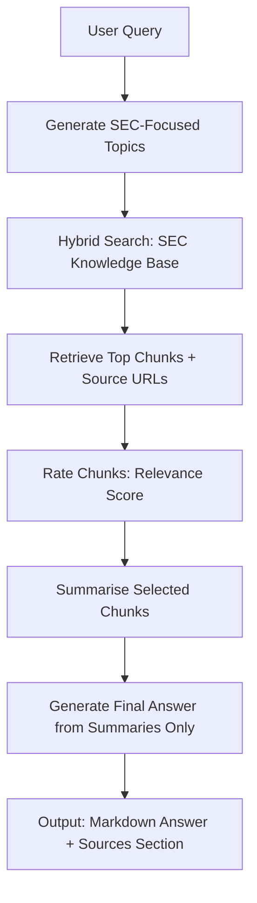

# SEC Crypto Application — Formal Documentation

*A unified platform for SEC-focused research, custody intelligence, and regulatory reporting—powered by a structured SEC knowledge base and AI agents that use only SEC-credible sources.*

## 1. Introduction

This document provides a formal overview of the **SEC Crypto Application**—a powerful, purpose-built platform that delivers structured access to U.S. Securities and Exchange Commission (SEC) materials and uses AI-powered agents to answer questions, produce weekly newsletters, and generate round table and overall regulatory intelligence reports.

What makes this application stand out is its **relentless grounding in credible SEC and related official sources**. Every feature relies on a structured SEC knowledge base and uses only SEC-credible content where applicable, giving users confidence in the accuracy, traceability, and defensibility of the information—whether for compliance, policy analysis, or executive briefing.

The combination of a curated knowledge base, intelligent retrieval, and report-generation agents makes this application an **invaluable tool** for legal, compliance, and business teams who need to stay ahead of SEC developments without sacrificing source transparency.

## 2. SEC AI Assistant

### 2.1 Overview

The **SEC AI Assistant** is the centerpiece of the application: an intelligent question-answering feature that lets users ask questions in plain English about SEC regulations, guidance, enforcement, and crypto-related policy. Answers are generated **only** from content retrieved from the structured SEC knowledge base, so every response is grounded in official SEC materials and includes source links for verification.

This design makes the assistant exceptionally well-suited for compliance research, due diligence, and policy analysis—where unsourced or speculative answers are not acceptable.

### 2.2 How It Works (Simple Description)

When you submit a question, the system first **expands** your question into several SEC-focused search topics. It then **searches** the SEC knowledge base (indexed SEC.gov documents) for the most relevant passages, **scores** those passages for relevance to your question, and **summarises** the most promising ones in a question-focused way. A final answer is written using **only** those summaries, with a clear separation between facts and analysis. Every answer ends with a **Sources** section listing the SEC.gov URLs used, so you can explore and verify the underlying documents at a click.

This end-to-end pipeline ensures that the assistant never "hallucinates" beyond the knowledge base—a major advantage for regulated and compliance-sensitive use cases.

### 2.3 Process Flow

The high-level flow of the SEC AI Assistant is captured in the following diagram. The design keeps answers tied to the knowledge base and makes it easy to trace any claim back to an official SEC source.

**Flow summary:** User Query → Generate SEC-focused topics → Hybrid search over SEC knowledge base → Retrieve top chunks with source URLs → Rate chunks for relevance → Summarise selected chunks → Generate final answer from summaries only → Output Markdown answer with Sources section.

### 2.4 Benefits

- **Structured SEC knowledge base:** All answers are derived from indexed SEC.gov content, not general web or unsourced material.
- **Source transparency:** Every response includes a Sources section with direct links to SEC.gov documents, supporting compliance and due diligence.
- **SEC-only focus:** The assistant is constrained to SEC regulations, guidance, enforcement, and policy, avoiding speculation from non-SEC sources.

### 2.5 Sample Questions and Answers

The following are sample questions and answers produced by the SEC AI Assistant from the knowledge base. They illustrate the **full**, factual, sourced responses users can expect—**included in full** (no truncation) to showcase the depth and quality of the assistant.

---

**Question 1**  
can sentiment analysis of public submissions to the sec’s crypto task force reveal shifting industry attitudes toward specific policy areas (e.g., defi, stablecoins)?

**Answer**  
Yes. If you run sentiment analysis across the SEC Crypto Task Force’s written submissions and track them over time, you can detect whether industry views are becoming more supportive, more worried, or more demanding of changes in specific policy areas (like DeFi or stablecoins).

How this can work based on the submissions and SEC’s request for input:

- **There is an ongoing stream of written input to analyze.** The Task Force invites written submissions by email, and the Commission is actively requesting public input and welcoming a wide range of perspectives (including skeptics). That mix of viewpoints is well-suited to sentiment scoring (supportive vs. critical) and to trend analysis by date.
- **Submissions contain topic-specific “signals” you can classify and measure.** Examples show clear positions that could be tagged by policy area and scored for tone:
  - **DeFi / non-custodial infrastructure:**  
    - Wintermute argues DeFi should be allowed to “flourish” and asks for guidance/exemptive relief so certain DeFi activities (e.g., liquidity provision) would not trigger broker-dealer registration—an explicitly positive stance toward DeFi growth paired with concern about regulatory uncertainty.  
    - Solana Policy Institute and DeFi Education Fund argue non-custodial wallets and “neutral user interfaces” do not custody assets or “effect transactions,” and that obligations should attach to actual function—another policy-area-specific position you can sentiment-score and compare with later submissions.
  - **Stablecoins / settlement:**  
    - Wintermute urges the SEC to clarify that using stablecoins (or other non-security digital assets) for tokenized-securities settlement is permissible, and it “applauds” prior SEC staff statements that certain stablecoins are not securities—clear positive/constructive sentiment that could be tracked against future submissions.
  - **Other policy areas (e.g., fund rules / qualifying investments):**  
    - CoinList/Amalgamated Token Services & Manatt seek treatment of certain token-related convertible instruments (e.g., token warrants, SAFTs) and select digital assets as “qualifying investments” under the venture capital fund exemption, emphasizing operational and compliance difficulties—content that can be tagged and scored to see whether that concern rises or falls across submissions.

Because the SEC’s request for input also provides an issue taxonomy for organizing responses, you can categorize submissions by area (e.g., DeFi, stablecoins, tokenized securities, fund-treatment questions) and then measure how sentiment and key themes change as more submissions arrive.

## Sources

- SEC Crypto Task Force invites written input to [crypto@sec.gov](mailto:crypto@sec.gov) — [https://www.sec.gov/newsroom/speeches-statements/peirce-journey-begins-020425](https://www.sec.gov/newsroom/speeches-statements/peirce-journey-begins-020425)  
- SEC request for public input (RFI), welcomes wide range of perspectives and provides issue taxonomy — [https://www.sec.gov/newsroom/speeches-statements/peirce-statement-rfi-022125](https://www.sec.gov/newsroom/speeches-statements/peirce-statement-rfi-022125)  
- Wintermute response expressing positions on DeFi and stablecoins/settlement — [https://www.sec.gov/files/wintermute-response-sec-090325.pdf](https://www.sec.gov/files/wintermute-response-sec-090325.pdf)  
- Solana Policy Institute & DeFi Education Fund letter on non-custodial wallets and neutral UIs — [https://www.sec.gov/files/ctf-written-letter-02-10-2026.pdf](https://www.sec.gov/files/ctf-written-letter-02-10-2026.pdf)  
- CoinList/Amalgamated Token Services & Manatt memo on venture capital fund exemption treatment — [https://www.sec.gov/files/ctf-memo-amalgamated-token-services-inc-manatt-phelps-phillips-llp-061625.pdf](https://www.sec.gov/files/ctf-memo-amalgamated-token-services-inc-manatt-phelps-phillips-llp-061625.pdf)

---

**Question 2**  
can the system forecast potential policy outcomes under proposed u.s. legislation like fit21, using extracted trends from sec and cftc harmonization documents?

**Answer**  
Yes—at a high level, the system can produce *trend‑based* projections about likely regulatory focus areas and the kinds of coordinated outcomes policymakers may pursue, by extracting signals from SEC–CFTC harmonization materials.

From the SEC–CFTC joint harmonization statement, the strongest “trend features” a forecasting system could extract are the agencies’ stated intent to coordinate using existing authorities (including exemptive authority) and the specific priority topics they identify for harmonization. Those topics include:

- harmonizing product/venue definitions, reporting/data standards, and capital/margin frameworks;
- potential expansion to 24/7 trading where appropriate;
- clarifying treatment of event/prediction contracts for U.S. participants;
- considering onshoring/permitting perpetual contracts that meet investor‑protection standards;
- developing coordinated portfolio‑margining across SEC/CFTC products and clearinghouses; and
- creating “innovation exemptions” and safe harbors for DeFi and peer‑to‑peer trading while longer‑term rulemaking proceeds.

Separately, a legislative framework like the “Digital Markets Restructure Act of 2026” discussion draft describes infrastructure that would make automated trend extraction and modeling much more systematic—e.g., a jointly operated Unified Digital Market Registry with machine‑readable submissions, a permissioned supervisory audit ledger (“RegNode”) with time‑stamped official records, and harmonized data standards/interoperability requirements. Those elements are the kind of inputs a forecasting system could use to quantify and track regulatory actions and harmonization over time.

## Sources

- SEC–CFTC joint statement on regulatory harmonization (priority areas; intent to use existing authorities; harmonization roundtable) — [https://www.sec.gov/newsroom/speeches-statements/joint-statement-atkins-pham-090525](https://www.sec.gov/newsroom/speeches-statements/joint-statement-atkins-pham-090525)  
- Crypto Task Force letter + “Digital Markets Restructure Act of 2026” discussion draft (Unified Digital Market Registry; RegNode; harmonized data standards) — [https://www.sec.gov/files/tgg-sec-crypto-task-force-letter-012626.pdf](https://www.sec.gov/files/tgg-sec-crypto-task-force-letter-012626.pdf)  
- Written input describing machine‑readable standards/APIs and analytics-oriented reporting concepts — [https://www.sec.gov/files/ctf-written-input-daniel-bruno-corvelo-costa-091125.pdf](https://www.sec.gov/files/ctf-written-input-daniel-bruno-corvelo-costa-091125.pdf)

---

**Question 3**  
can the system generate a comparative matrix of sec regulations versus the uk’s phased crypto regime and highlight convergence or divergence areas?

**Answer**  
Yes. Below is a comparative-matrix structure with the **SEC/U.S.** side populated from SEC materials, and a **UK phased regime** column ready to be filled. The last column flags **convergence/divergence** only where the SEC summaries themselves make an explicit cross‑jurisdiction point.

## Comparative matrix (SEC regulations/guidance vs UK phased crypto regime)

| Topic / “row” for comparison                                            | SEC / U.S. (from SEC materials)                                                                                                                                                                                                                                                                                                                                                                                                                                                                                                           | UK phased crypto regime (fill in) | Convergence / divergence signals explicitly stated in SEC materials                                                               |
| ----------------------------------------------------------------------- | ----------------------------------------------------------------------------------------------------------------------------------------------------------------------------------------------------------------------------------------------------------------------------------------------------------------------------------------------------------------------------------------------------------------------------------------------------------------------------------------------------------------------------------------- | --------------------------------- | --------------------------------------------------------------------------------------------------------------------------------- |
| Core legal classification approach for digital assets                   | Uses a **Howey “investment contract” analysis** focused on “economic reality” (form is secondary to substance). Core prongs: **(1) investment of money**, **(2) common enterprise**, **(3) reasonable expectation of profits from the efforts of others**.                                                                                                                                                                                                                                                                                |                                   | —                                                                                                                                 |
| “Efforts of others” / reliance on an active promoter                    | Factors indicating reliance on an **Active Participant (AP)**: AP responsible for development/operation/promotion; network not fully functional at sale; essential tasks done by AP rather than a decentralized community; AP supports/creates a market or influences supply (e.g., buybacks/burns); AP has central governance/code update/validation role; AP retains ongoing managerial discretion (use of proceeds, listings, distributions, validation/security, etc.); AP has incentives to raise value.                             |                                   | —                                                                                                                                 |
| Enforcement posture and regulatory approach (context)                   | Describes a period of **aggressive crypto enforcement** (referenced as many actions), and later actions including **rescission of SAB 121**, dismissal of several enforcement actions, and issuance of **clarifying staff guidance** (including on memecoins and covered stablecoins). Also urges **tailored regulation** rather than applying legacy rules unchanged.                                                                                                                                                                    |                                   | —                                                                                                                                 |
| Tokenization / tokenized securities treatment                           | Recommends enabling **blockchain-based clearance and settlement** (building on a Paxos pilot/no-action relief concept). Recommends that tokens that **only represent an already-registered or exempt security** not require separate SEC registration. Recommends allowing tokenized securities and non-securities to **trade side-by-side** with appropriate disclosures/safeguards.                                                                                                                                                     |                                   | —                                                                                                                                 |
| Asset taxonomy (tokens vs investment contracts vs tokenized securities) | Distinguishes between **(a) Tokens** (blockchain-native assets), **(b) investment contracts** (a securities category that may relate to Tokens), and **(c) tokenized securities** (traditional securities recorded on a ledger). Recommends SEC clarify **investment contracts are not equity securities** and need bespoke treatment.                                                                                                                                                                                                    |                                   | —                                                                                                                                 |
| Consequences of classification (which SEC rules apply)                  | Notes many Securities Act/Exchange Act requirements depend on security type (equity vs debt vs other). Cites areas needing clarity/relief: **Reg S / Rule 144**, **Exchange Act 12(g)** equity thresholds, and form-identification issues (e.g., **Form D, Form 1‑A**). Argues certain **equity-issuer ongoing obligations** should not automatically apply to investment-contract securities (e.g., parts of **Section 13** tender offer rules; **Reg 13D‑G**; **Rule 13f‑1**; **Section 14** proxy; **Section 16** short‑swing profit). |                                   | —                                                                                                                                 |
| Memecoins / “non-compliant” token controls (proposal)                   | Proposes a ban on **non-compliant memecoins**, defined as tokens lacking **verifiable utility**, **transparent governance**, or **AML/KYC** adherence; stated goals include investor protection, market integrity, reducing systemic risk and regulatory arbitrage.                                                                                                                                                                                                                                                                       |                                   | The proposal mentions the UK’s **forthcoming stablecoin and crypto‑asset regime** in passing (without detailing UK rules/phases). |
| AML/KYC expectations (as a stated compliance element)                   | In the memecoin proposal, **AML/KYC adherence** is part of the minimum compliance concept for avoiding “non-compliant” status.                                                                                                                                                                                                                                                                                                                                                                                                            |                                   | —                                                                                                                                 |

### How to use this matrix to highlight convergence/divergence

- Treat each row as a **comparison axis** (classification test, promoter reliance factors, tokenization market structure, custody/trading, disclosure, AML/KYC, etc.).
- Fill the UK column with the UK regime’s **phase-by-phase requirements**, then mark each row as **aligned / partially aligned / different** based on whether the UK addresses the same policy lever (e.g., Howey-style “investment contract” analysis vs a different classification scheme; memecoin controls; stablecoin rules; trading venue and settlement structure).

## Sources

- SEC Framework for “Investment Contract” Analysis of Digital Assets — [https://www.sec.gov/about/divisions-offices/division-corporation-finance/framework-investment-contract-analysis-digital-assets](https://www.sec.gov/about/divisions-offices/division-corporation-finance/framework-investment-contract-analysis-digital-assets)
- ACII comment letter to SEC Crypto Task Force (May 14, 2025) — [https://www.sec.gov/files/acii-comment-letter-crypto-task-force-051425.pdf](https://www.sec.gov/files/acii-comment-letter-crypto-task-force-051425.pdf)
- Crypto Task Force written technical proposal (Regulation) (Sept. 8, 2025) — [https://www.sec.gov/files/ctf-written-technical-proposal-regulation-09-08-2025.pdf](https://www.sec.gov/files/ctf-written-technical-proposal-regulation-09-08-2025.pdf)
- Sidley/TDC submission (June 26, 2025) — [https://www.sec.gov/files/ctf-tdc-062625.pdf](https://www.sec.gov/files/ctf-tdc-062625.pdf)

---

## 3. Custody Newsletter Agent

### 3.1 Overview

The **Custody Newsletter Agent** is a powerful automation that produces a weekly **Crypto Custody Intelligence** newsletter. It is designed to run on a schedule (e.g. weekly) and to generate a **fresh report every Monday** for the preceding week, so that users receive a consistent, up-to-date digest of SEC developments relevant to crypto custody and related regulation—without manual curation.

### 3.2 How It Works

The agent **discovers** relevant SEC content for a given date range by visiting configured SEC.gov pages (e.g. speeches, task force, enforcement, rulemaking). It **extracts** links to articles, speeches, and releases published within that range, **fetches** each document, and uses an AI agent to extract structured information—facts, quotes, decisions, and implications for broker-dealers, RIAs, banks, and custodians. Optionally, it can also pull in additional context from the SEC knowledge base (RAG) for a custody-angle summary. Finally, it **synthesises** all of this into a single newsletter in a fixed structure: This Week at a Glance, Top Stories with implications by entity type, Regulatory Tracker, Enforcement Watch, Banking Regulator Corner, What's Coming, Compliance Action Items, and a Resource Library.

### 3.3 Sources and Direct Links

Each newsletter section **cites sources** that help users explore and dive deep into the story. Every fact or claim that comes from an SEC document is tied to a **source URL**. The newsletter includes a **Resource Library** section presented as a table of links, and inline citations use the format "(Source: [https://www.sec.gov/](https://www.sec.gov/)...)". Users can **click these direct links** to open the original SEC.gov page and verify or read the full context—making the newsletter not only informative but auditable and research-friendly.

### 3.4 Beta Version and Future Enhancements

In the current **beta** version, the newsletter agent is configured to use **SEC-base sources only** (e.g. sec.gov featured topics, divisions, newsroom, enforcement, rulemaking). This ensures that the newsletter is grounded in official SEC material. For production, the set of sources **can be expanded** to cover other credible regulators or policy sources if requested. The newsletter **format** (sections, length, tone) can also be **tweaked on request**. Additional features and sections can be added upon request for production use.

### 3.5 Benefits

- **Weekly, consistent delivery** of a custody-focused digest without manual curation.
- **Every story and fact** is traceable to SEC (or configured) sources via direct links.
- **Structured layout** (tables, implications by entity type) supports quick scanning and compliance review.

### 3.6 Sections Included in the Newsletter Report

Each weekly **Custody Intelligence** newsletter (see sample reports in `reports/newsletter/`) follows a fixed, repeatable structure so readers know exactly where to find what they need:

| Section | What It Contains | Why It's Useful |
|--------|--------------------|-----------------|
| **Custody Intelligence Weekly** (header) | Title, subtitle, week/date range, issue number, one-paragraph week summary | Orients the reader and sets the tone; executives get the "so what" in one glance. |
| **This Week at a Glance** | Metrics table (e.g. SEC releases, enforcement actions, no-action letters, banking guidance) + **Bottom Line** paragraph | Quick quantitative and qualitative snapshot; supports weekly dashboards and status updates. |
| **Top Stories** | Numbered stories; each with **FACTS** (with source URLs), **ANALYSIS**, **INFERENCE**, and **Implications** by entity (broker-dealers, RIAs, banks/trusts, crypto custodians) | Ensures every development is grounded in cited facts, separated from analysis and inference, and translated into "what this means for me" by role. |
| **Regulatory Tracker Update** | Two tables: (1) Rules & guidance in effect; (2) Pending/expected developments (with effective date, status, impact, source) | Single place to track what's live vs. what's coming; reduces missed deadlines and duplicate research. |
| **Enforcement Watch** | Table of custody-related cases (status, issue, next event) + **Trends** (FACTS/ANALYSIS/INFERENCE) | Surfaces enforcement patterns and upcoming events; supports risk and compliance prioritisation. |
| **Banking Regulator Corner** | Banking-regulator guidance and key outstanding questions (with sources) | Keeps custody teams aligned with OCC/FDIC/Fed where it intersects SEC. |
| **What's Coming** | Calendar table (date, event, relevance) + **Questions We're Tracking** | Forward-looking view for planning and comment deadlines. |
| **Compliance Action Items** | Checklist of concrete tasks (e.g. recalc net capital, build evidence packet, draft input) with source links | Turns insight into action; reduces "what should we do?" follow-up. |
| **Resource Library** | Table of documents/resources with date, description, and **direct SEC.gov (or source) links** | One-click access to primary sources for deeper dives and audit trails. |
| **Feedback & About** | How to request topics; short "About" blurb | Keeps the newsletter responsive to user needs. |

### 3.7 Merits of the Newsletter Report

- **Auditability:** Every fact is tagged FACTS/ANALYSIS/INFERENCE and tied to a source URL, so compliance and legal can verify claims against the original SEC material.
- **Role-based implications:** Implications are broken out by broker-dealers, RIAs, banks/trusts, and crypto custodians, so each reader finds "what this means for us" without re-reading the whole report.
- **Actionability:** The Compliance Action Items section turns regulatory developments into a concrete checklist, reducing the gap between "we read the newsletter" and "we changed our process."
- **Consistency:** The same structure every week lowers cognitive load and makes it easy to compare weeks or hand off to colleagues.
- **Discoverability:** The Resource Library and inline source links let users explore and dive deep into any story with direct links to SEC.gov (or configured sources).

---

## 4. Round Table Meeting Agent

### 4.1 Overview

The **Round Table Meeting Agent** generates detailed, structured reports for SEC round table meetings. Given a meeting URL and a transcript file, it analyses the transcript and any parsed meeting-page content to produce a report suitable for internal briefing and compliance use—**saving significant time** over manual summarisation and ensuring consistent structure and source attribution.

### 4.2 How It Works

The agent loads the meeting transcript and the meeting URL. It may **parse** the SEC meeting page to capture title, description, and participants. It can use the **SEC knowledge base (RAG search)** to pull in relevant regulations or guidance, and optional **web search** for speaker or context. It then produces a report that includes: **key speakers** with influence and activity ratings, **views on topics** discussed, **meeting conclusions**, and **key points and main arguments**. The report is saved in the chosen format (e.g. TXT, DOCX) and includes a **Sources** section.

### 4.3 Benefits

- **Consistent structure** across round table reports (speakers, topics, conclusions, sources).
- **Evidence-based** speaker and topic analysis, with optional grounding in the SEC knowledge base.
- **Ready for internal distribution** or further summarisation in broader intelligence products.

### 4.4 Sections Included in the Round Table Meeting Report

Each **SEC Round Table Meeting Report** (generated from a meeting URL and transcript file) follows a fixed structure so that every meeting is analysed and presented in the same way:

| Section | What It Contains | Why It's Useful |
|--------|--------------------|-----------------|
| **SEC ROUND TABLE MEETING REPORT** (header) | Meeting URL, transcript reference | Clear provenance for the report. |
| **1. EXECUTIVE SUMMARY** | Brief overview of the meeting (theme, outcome, key takeaway) | Busy readers get the gist in one paragraph; supports inclusion in leadership briefs. |
| **2. KEY SPEAKERS ANALYSIS** | For each key speaker: name, affiliation, **Influence Rating (1–10)** with justification, **Activity Level**, **Argument Strength (1–10)** with justification, Key Contributions; plus **Most Influential Speaker** with reasoning | Identifies who drove the discussion and how strongly; supports stakeholder mapping and follow-up. |
| **3. VIEWS ON TOPICS** | For each main topic: topic name, **Viewpoints** (different perspectives), **Consensus/Disagreements** | Surfaces where the SEC, industry, and other participants align or diverge; informs policy and positioning. |
| **4. MEETING CONCLUSION** | Overall outcome, action items or next steps, key takeaways | Answers "what was decided or signalled?" and "what happens next?" |
| **5. KEY POINTS AND MAIN ARGUMENTS/EVENTS** | Bulleted list of key points, main arguments, significant moments | Provides a searchable, scannable record of the meeting's substance. |
| **6. SOURCES** | Meeting URL, transcript file, any RAG or web-search sources used | Ensures traceability and allows readers to verify or go deeper. |

### 4.5 Merits of the Round Table Meeting Report

- **Objectivity:** Speaker ratings (influence, activity, argument strength) are derived from the transcript and optional SEC knowledge base, with justifications, reducing subjective "who said what" recall.
- **Reusability:** The same structure across meetings makes it easy to compare different round tables or feed multiple reports into the Overall Report Agent for cross-meeting intelligence.
- **Actionability:** The Meeting Conclusion and Key Points sections highlight outcomes and next steps, so compliance and policy teams can act on what was actually said.
- **Traceability:** The Sources section ties the report back to the official meeting URL and transcript (and any RAG/web sources), supporting audit and due diligence.

---

## 5. Overall Report Agent

### 5.1 Overview

The **Overall Report Agent** combines insights from **all** available SEC Round Table Meeting reports into a single **regulatory intelligence report**. It is intended for leadership and compliance teams who need a **cross-meeting** view of themes, speakers, and regulatory direction—delivering in one place what would otherwise require manual aggregation and analysis.

### 5.2 How It Works

The agent discovers all meeting report files (e.g. SEC_Meeting_Report_*.txt) in a given directory, **reads** their contents, and optionally uses the **SEC knowledge base** and **web search** for additional context. It then produces a comprehensive report that: **combines views** of the same speaker across meetings; **tags speakers** with topics they engaged with; **identifies the most influential stakeholder** across meetings; and outlines **future predictions** and implications for issuers, DeFi protocols, exchanges, and custodians. The report follows a fixed structure (Executive Intelligence Brief, Methodology, Cross-Meeting Evidence, Speaker Analysis, Topic Tagging, Most Influential Stakeholder, What This Means For…, Unresolved Questions & Regulatory Gaps, Future Predictions, Sources) and is output in Markdown or DOCX.

### 5.3 Benefits

- **Single, consolidated view** of multiple round tables for executives and compliance.
- **Evidence-based** identification of influential stakeholders and recurring themes.
- **Clear labeling** of predictions (explicitly stated vs. inferred vs. speculative) and a dedicated section on unresolved regulatory gaps.

### 5.4 Sections Included in the Overall Round Table Meeting Report

The **SEC Crypto Roundtable Regulatory Intelligence Report** (overall report) aggregates all available round table meeting reports into one structured intelligence document. It follows this exact structure:

| Section | What It Contains | Why It's Useful |
|--------|--------------------|-----------------|
| **1. EXECUTIVE INTELLIGENCE BRIEF** (1 page max) | 5–7 key takeaways, top 3 regulatory trajectories (with confidence High/Medium/Low), most influential stakeholders with evidence | Gives executives an immediately actionable, skimmable summary without reading the full report. |
| **2. METHODOLOGY NOTE** | Analysis approach, number of meetings analysed, data sources, confidence scoring | Ensures readers understand how the report was produced and how much weight to give it. |
| **3. CROSS-MEETING EVIDENCE SUMMARY** | **Topic × Meeting** frequency table, **Speaker × Topic** engagement matrix, recurring themes (≥3 meetings) vs. isolated mentions | Surfaces what is consistent across meetings vs. one-off; supports trend and gap analysis. |
| **4. SPEAKER ANALYSIS** | For each key speaker: **Authority** (formal role), **Influence** (evidence-based: repetition, alignment, directives, agenda-setting), **Likelihood of Policy Impact** (High/Medium/Low), combined views across meetings, evolution/consistency | Separates formal authority from substantive influence; helps prioritise engagement and monitoring. |
| **5. TOPIC TAGGING** | Topic taxonomy; **Speaker × Topic** matrix (topics engaged, depth, stance, meeting count) | Enables "who cares about what" and "who said what where" at a glance. |
| **6. MOST INFLUENTIAL STAKEHOLDER** | Evidence-based identification; separation of formal authority vs. substantive influence vs. policy impact likelihood; explicit signals (repetition, alignment, directives) | Informs who to watch and who drives policy direction. |
| **7. "WHAT THIS MEANS FOR..."** | Implications for **Issuers**, **DeFi Protocols**, **Exchanges/ATSs**, **Custodians/Compliance Teams** (bullet points, action items) | Translates cross-meeting intelligence into role-specific takeaways. |
| **8. UNRESOLVED QUESTIONS & REGULATORY GAPS** | Subcategories: Doctrinal/Legal, Operational/Compliance, Market Structure, Inter-agency/Legislative; for each gap: why it matters, which meetings raised it, who raised it, potential paths to resolution | Highlights open issues the SEC has not yet resolved; supports risk and strategy planning. |
| **9. FUTURE PREDICTIONS** | (A) Decisions on hold/planned—labeled [EXPLICITLY STATED] / [STRONGLY INFERRED] / [SPECULATIVE], with confidence; (B) SEC–crypto future predictions; (C) Future steps based on influencers; (D) **What Could Change These Predictions** (litigation, elections, inter-agency, etc.) | Makes the difference between what was said, what was inferred, and what is speculative explicit; supports scenario planning. |
| **10. SOURCES** | All meeting report files analysed, RAG and web-search citations | Full traceability for compliance and audit. |

### 5.5 Merits of the Overall Round Table Meeting Report

- **Executive-ready:** The Executive Intelligence Brief is designed for busy leaders; the rest of the report supports deeper dives when needed.
- **Evidence-based:** Speaker analysis separates Authority from Influence from Policy Impact Likelihood and uses explicit signals (repetition, alignment, directives), reducing vague "influence" claims.
- **Cross-meeting synthesis:** Topic × Meeting and Speaker × Topic tables show what is recurring vs. isolated, so trends and gaps are visible without re-reading every meeting.
- **Transparent predictions:** Every prediction is labeled [EXPLICITLY STATED], [STRONGLY INFERRED], or [SPECULATIVE], with confidence levels and "What Could Change These Predictions," so readers can weight conclusions appropriately.
- **Action-oriented:** "What This Means For..." and Unresolved Questions & Regulatory Gaps turn intelligence into implications and open issues, supporting compliance, strategy, and engagement planning.

---

## 6. Benefits of Using the Application

- **Structured SEC knowledge base:** All core features (AI Assistant, Newsletter, Round Table and Overall reports) draw on a central, indexed body of SEC and related credible material, ensuring **consistency and traceability**.
- **SEC-credible reporting:** The AI Assistant and report agents are designed to use **only SEC-credible sources** where applicable, reducing reliance on unsourced or third-party interpretation for critical compliance and policy questions.
- **Time savings:** Weekly newsletters and one-click round table and overall reports **dramatically reduce** manual collection and summarisation of SEC developments.
- **Transparency:** Direct source links in answers and newsletters allow users to **explore and verify** every claim against the original SEC document.

## 7. Additional Features and Customization

Additional features and sections can be **added upon request** for production. Examples include: expanding newsletter sources beyond SEC-base sources, customising newsletter format and sections, adding new report templates or output formats, and integrating with internal workflows or distribution channels. The documentation and behaviour of each agent can be extended to reflect such customisations.

## 8. Conclusion

The **SEC Crypto Application** delivers a **unified, trustworthy platform** for SEC-focused research, weekly custody intelligence, and round table and overall regulatory reporting. By combining a **structured SEC knowledge base** with AI-powered assistants and report agents that use **only SEC-credible sources**, the application empowers users to stay informed, verify information quickly, and make better-informed compliance and policy decisions.

The combination of the SEC AI Assistant, the Custody Newsletter Agent, the Round Table Meeting Agent, and the Overall Report Agent covers the full spectrum of use cases—from ad-hoc regulatory questions to scheduled digests and from single-meeting analysis to cross-meeting intelligence—making this application an **invaluable asset** for any organisation that needs to track and act on SEC and crypto-related regulatory developments with confidence and efficiency.