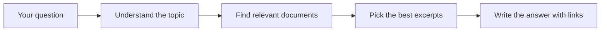

# How the CRI Chat Agent Works

A short guide to what happens when you ask a question in **Chat** mode.

---

## What it is

**CRI-Bot** is the assistant behind chat. It is built to answer questions about **SEC and crypto regulation** the way a sharp analyst would: clear, thorough, and grounded in CRI’s own document library—while still sounding like a person, not a search engine.

---

## What happens when you ask a question

Think of it as **four steps**:

### 1. Understand your question

The system reads your question and sorts it into CRI’s regulatory “map”—for example:

- **Topic area** (custody, trading, asset classification, etc.)
- **Stage** (proposal, final rule, staff guidance, enforcement, and so on)
- **How binding** the kind of source usually is (law vs. staff letter vs. informal discussion)

This helps focus the search on the right corner of the knowledge base.

### 2. Search the knowledge base

CRI keeps a large library of regulatory documents (rules, releases, guidance, cases, and more). The agent searches that library in two ways:

- **Focused search** — looks mainly in the topic area that fits your question  
- **Broader search** — also looks widely so nothing important is missed

Results from both passes are combined and de-duplicated.

### 3. Choose the most useful excerpts

Search returns many possible passages. A second pass **ranks** them: which snippets actually help answer *your* question? Stronger, more authoritative sources are preferred when several passages are equally relevant.

### 4. Write the answer (CRI-Bot)

An AI writer (**CRI-Bot**) turns the best excerpts into a **formatted HTML answer**:

- Reads like an expert briefing, not “here is what the database returned”
- **Links** to real sources for key claims
- **Notes** when something is staff guidance (not the same as a statute or Commission rule)
- Can add **general regulatory background** when the library is thin—but labels that clearly
- Ends with a **Sources** list you can click through

If nothing useful is found, it says so plainly instead of making things up.

---

## What you see in the app

| What you see                              | What it means                                                                                |
| ----------------------------------------- | -------------------------------------------------------------------------------------------- |
| **Chat reply**                            | CRI-Bot’s HTML answer with headings, lists, and links                                        |
| **Retrieval details** (optional expander) | Behind-the-scenes info: topic tags, how many documents were found, which were ranked highest |
| **Prior messages**                        | Recent conversation is remembered so follow-up questions can build on earlier answers        |

---

## What CRI-Bot will and won’t do

**Will**

- Give detailed answers on complex regulatory topics when evidence supports them  
- Cite CRI documents with links when they support a point  
- Flag uncertainty or evolving areas (e.g. how a token is classified)

**Won’t**

- Invent fake links, case numbers, or dates  
- Talk like a robot (“the knowledge base says…”)  
- Pretend a staff FAQ has the same weight as an enacted law

---

## In one sentence

You ask a regulatory question → the system **classifies** it, **searches** CRI’s documents, **picks** the best passages, and **CRI-Bot writes** a cited, readable answer you can trust and share.