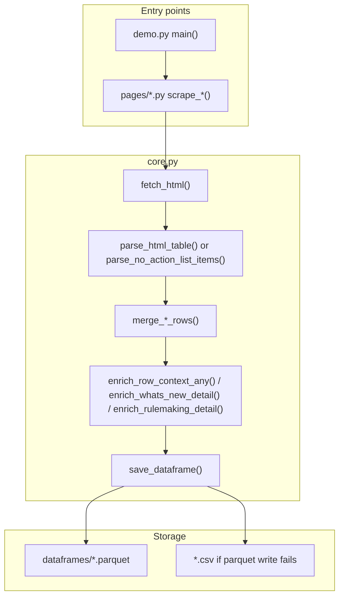

# SEC scraping documentation

The `sec_scraping` package scrapes SEC.gov list pages into structured pandas DataFrames, optionally fetches detail-page or PDF text, and persists results as Parquet files for downstream use (for example vectorization via the `vectorized` column).

## Package layout

| Path | Purpose |
|------|---------|
| [`pages/`](../pages/) | One module per SEC list page; each exposes a `scrape_*()` entry point |
| [`core.py`](../core.py) | Shared HTTP, HTML table parsing, merge/dedup, detail enrichment, persistence |
| [`dataframes/`](../dataframes/) | Output Parquet (and optional CSV fallback) per scraper |
| [`demo.py`](../demo.py) | Manual runner that prints row previews after scraping |
| [`ingest.py`](../ingest.py) | Embed scraper parquets into Pinecone (`vectorized` pipeline) |
| [`schedule_jobs/`](../schedule_jobs/) | Per-page CLI jobs (scrape / embed / pipeline) — see [schedule_jobs.md](schedule_jobs.md) |
| [`doc/`](.) | This documentation |

## End-to-end flow



## Shared behavior (`core.py`)

Page-specific docs assume the following unless noted otherwise.

### HTTP

- Base URL: `https://www.sec.gov`
- Requests use `_sec_headers()` from `cri_ontology.document_context`
- **1.5 second delay** before each request (`DEFAULT_REQUEST_DELAY`)
- Timeout: 20 seconds; redirects allowed

### List table parsing

`parse_html_table()` finds the first HTML `<table>` whose header row matches `expected_headers` (case-insensitive). Drupal sort labels (`Sort ascending` / `Sort descending`) are stripped from headers.

- Column names are slugified: `"Release No."` → `release_no`, `"Speaker/Division"` → `speaker_division`
- Cell text is stored in the slug column
- If a cell contains `<a href>`, an additional `{column}_url` column holds the absolute SEC URL

### Pagination (`run_paginated_table_scraper`)

Default list URL (when no custom builder is supplied):

```
{base_url}?search=&year={year}&month={month}&page={page}
```

`page` starts at `0` and increments after each successful page. The loop stops when:

- `max_pages` is reached (if set)
- HTTP **404** on the list URL
- Page HTML indicates **no results**
- Table parse returns no rows
- Rows are empty after **month/year filter**
- **Repeated page signature** (same set of `row_key` values as a prior page)
- `added == 0` and `fetch_context=False` (early exit)

The dataframe is **saved after each page**.

On load, the existing parquet is passed through `normalize_and_filter_dataframe()` so only rows whose `date_normalized` starts with `{year}-{month:02d}-` are kept (requires a `date` column).

### Single-page tables (`run_single_page_table_scraper`)

One list fetch, month/year filter on parsed rows, merge, save once. Same month filter on load as paginated scrapers.

### No-action lists (`run_no_action_list_scraper`)

Three static division index URLs (no table pagination). Items are parsed from `<li>` elements with `data-list-item-id` and a link. The dataframe is **saved after each division**. No month/year filter on load.

### Deduplication

| Pattern | Key |
|---------|-----|
| Table scrapers (default) | `row_key` from `make_row_key()` — alphanumeric concatenation of all non-URL column values |
| No-action letters | `list_item_id` (Drupal `data-list-item-id`, or SHA-256 of `title_url`); also stored as `row_key` |

If a row already exists and `fetch_context=True`, scrapers **backfill** empty `context` (and `resources` where applicable) from the detail URL.

### Detail enrichment

`primary_detail_url()` resolution order:

1. `title_url`
2. `status_url`
3. First other `*_url` column with a value

Text extraction uses `cri_ontology.document_context` (`extract_title_and_text_from_url`, `extract_title_and_text_from_html`).

| Enricher | Used by |
|----------|---------|
| `enrich_row_context_any()` | Crypto task force table scrapers (`merge_scraped_rows`) |
| `enrich_whats_new_detail()` | What's New, Press Releases, Speeches & Statements, No-Action Letters |
| `enrich_rulemaking_detail()` | Rulemaking Activity |

**File URLs** (PDF, etc.): context text only; `resources` is `"[]"` for newsroom-family scrapers.

**HTML detail pages**: main body in `context` / `context_title`; right-rail links in `resources` as JSON.

### `resources` column format

JSON **string** containing a list of objects:

```json
[
  {
    "label": "Related resource title",
    "url": "https://www.sec.gov/...",
    "context_title": "...",
    "context": "..."
  }
]
```

Right-rail selectors tried in order: `div.side-resources`, `div.rightrail-list` (with “resource” heading), `ul.field--name-field-see-also`.

### Persistence

| Function | Behavior |
|----------|----------|
| `save_dataframe()` | Writes Apache **Parquet** (`index=False`). On failure, writes **CSV** with the same basename. |
| `load_dataframe()` | Reads `.parquet` or `.csv`; returns empty schema-aware frame if missing |

Output directory: `sec_scraping/dataframes/<name>.parquet` (path relative to package root).

## Standard metadata columns

Present on all scrapers (page-specific list columns are additional):

| Column | Description |
|--------|-------------|
| `row_key` | Stable deduplication id |
| `source_list_url` | List page URL when the row was scraped |
| `scraped_at` | UTC ISO-8601 timestamp when the row was first added |
| `vectorized` | `bool`, default `False` — set `True` by [ingest](ingest.md) after successful Pinecone upsert |
| `context_title` | Title from detail page or PDF |
| `context` | Full extracted body text |
| `date_normalized` | `YYYY-MM-DD` when a date field is available |
| `resources` | JSON string of side resources (rulemaking + newsroom-family + no-action only) |

## Scraper index

| Documentation | Module | Parquet | Pattern | Merge function |
|---------------|--------|---------|---------|----------------|
| [crypto_newsroom.md](crypto_newsroom.md) | [crypto_newsroom.py](../pages/crypto_newsroom.py) | `dataframes/crypto_newsroom.parquet` | Paginated table | `merge_scraped_rows` |
| [crypto_task_force_meetings.md](crypto_task_force_meetings.md) | [crypto_task_force_meetings.py](../pages/crypto_task_force_meetings.py) | `dataframes/crypto_task_force_meetings.parquet` | Single page | `merge_scraped_rows` |
| [crypto_written_input.md](crypto_written_input.md) | [crypto_written_input.py](../pages/crypto_written_input.py) | `dataframes/crypto_written_input.parquet` | Paginated table | `merge_scraped_rows` |
| [cryptosec.md](cryptosec.md) | [cryptosec.py](../pages/cryptosec.py) | `dataframes/cryptosec.parquet` | Paginated table | `merge_scraped_rows` |
| [rulemaking_activity.md](rulemaking_activity.md) | [rulemaking_activity.py](../pages/rulemaking_activity.py) | `dataframes/rulemaking_activity.parquet` | Custom single fetch | `merge_rulemaking_rows` |
| [whats_new.md](whats_new.md) | [whats_new.py](../pages/whats_new.py) | `dataframes/whats_new.parquet` | Paginated + custom URL | `merge_whats_new_rows` |
| [press_releases.md](press_releases.md) | [press_releases.py](../pages/press_releases.py) | `dataframes/press_releases.parquet` | Paginated + custom URL | `merge_whats_new_rows` |
| [speeches_statements.md](speeches_statements.md) | [speeches_statements.py](../pages/speeches_statements.py) | `dataframes/speeches_statements.parquet` | Paginated + custom URL | `merge_whats_new_rows` |
| [no_action_letters.md](no_action_letters.md) | [no_action_letters.py](../pages/no_action_letters.py) | `dataframes/no_action_letters.parquet` | Three division lists | `merge_no_action_rows` |

### Scheduled job docs

| Job doc | `sec_dataset` |
|---------|---------------|
| [schedule_jobs_crypto_newsroom.md](schedule_jobs_crypto_newsroom.md) | `crypto-newsroom` |
| [schedule_jobs_crypto_written_input.md](schedule_jobs_crypto_written_input.md) | `crypto-written-input` |
| [schedule_jobs_crypto_task_force_meetings.md](schedule_jobs_crypto_task_force_meetings.md) | `crypto-task-force-meetings` |
| [schedule_jobs_cryptosec.md](schedule_jobs_cryptosec.md) | `cryptosec` |
| [schedule_jobs_whats_new.md](schedule_jobs_whats_new.md) | `whats-new` |
| [schedule_jobs_press_releases.md](schedule_jobs_press_releases.md) | `press-releases` |
| [schedule_jobs_speeches_statements.md](schedule_jobs_speeches_statements.md) | `speeches-statements` |
| [schedule_jobs_rulemaking_activity.md](schedule_jobs_rulemaking_activity.md) | `rulemaking-activity` |
| [schedule_jobs_no_action_letters.md](schedule_jobs_no_action_letters.md) | `no-action-letters` |

## Scheduled jobs

For production scrape and embed runs, use **[schedule_jobs.md](schedule_jobs.md)** instead of editing `demo.py`. Each SEC page has a module under `sec_scraping/schedule_jobs/` with shared period parsing, logging, and tqdm progress.

```bash
python -m sec_scraping.schedule_jobs.crypto_newsroom --mode pipeline
```

## Vector ingest

After scraping, embed pending rows into Pinecone and write classification backups. Ingest classifies each segment (main or resource) once, then chunks and applies the same CRI metadata to every chunk from that segment. See **[ingest.md](ingest.md)** for flow, `embed_*` tables, CLI flags, and module structure. Scheduled jobs call the same `run_ingest()` with `--mode embed` or `pipeline`.

```bash
python -m sec_scraping.ingest --test
```

## How to run

### Programmatic

```python
from sec_scraping.pages.crypto_newsroom import scrape_crypto_newsroom

df = scrape_crypto_newsroom(year=2026, month=3, fetch_context=True)
```

### Demo script

From the repository root:

```bash
python sec_scraping/demo.py
```

Edit the `scrapers` list in `demo.py` `main()` to enable/disable sources. As shipped, only **No-Action Letters** runs with `test_mode=True`.

### CLI (no-action letters only)

```bash
python -m sec_scraping.pages.no_action_letters
python -m sec_scraping.pages.no_action_letters --test
python -m sec_scraping.pages.no_action_letters --no-context
```
