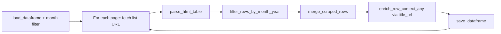

# Crypto Newsroom

[← Back to index](README.md)

## Overview

| | |
|--|--|
| **SEC page** | Crypto Task Force Newsroom |
| **Source URL** | https://www.sec.gov/about/crypto-task-force/crypto-newsroom |
| **Module** | [`pages/crypto_newsroom.py`](../pages/crypto_newsroom.py) |
| **Storage** | `sec_scraping/dataframes/crypto_newsroom.parquet` |

## Entry point

```python
scrape_crypto_newsroom(
    *,
    year: int = 2026,
    month: int = 3,
    max_pages: Optional[int] = None,
    fetch_context: bool = True,
) -> pd.DataFrame
```

| Parameter | Description |
|-----------|-------------|
| `year`, `month` | Filter list rows and existing parquet to this calendar month |
| `max_pages` | Cap pagination (`None` = no cap) |
| `fetch_context` | Fetch detail URL text for new rows; backfill empty context on existing rows |

## Flow



Uses [`run_paginated_table_scraper`](../core.py) with default pagination URL builder.

## List scraping

**Expected headers:** `Date`, `Title`, `Speaker`

**Pagination URL:**

```
https://www.sec.gov/about/crypto-task-force/crypto-newsroom?search=&year={year}&month={month}&page={page}
```

| List column | Source header | Notes |
|-------------|---------------|-------|
| `date` | Date | |
| `title` | Title | |
| `title_url` | Title link | Detail page when present |
| `speaker` | Speaker | |
| `speaker_url` | Speaker link | Only if speaker cell is linked |
| `date_normalized` | Derived | Set during month filter (`YYYY-MM-DD`) |

## Detail enrichment

- **Merge:** `merge_scraped_rows`
- **Detail URL:** `title_url` (via `primary_detail_url()`)
- **Method:** `enrich_row_context_any()` — supports HTML and PDF
- **`resources`:** Not used

## Deduplication and incremental updates

- **Key:** `row_key` from `make_row_key()` over `date`, `title`, `speaker`
- **Existing rows:** If `context` is empty and `fetch_context=True`, detail text is fetched and updated in place
- **Save cadence:** After each paginated list page

## Storage

| | |
|--|--|
| **Path** | `sec_scraping/dataframes/crypto_newsroom.parquet` |
| **Format** | Apache Parquet (`pandas`, `index=False`); CSV fallback on write failure |
| **Scope on load** | Rows kept only if `date_normalized` matches `{year}-{month:02d}-*` |

## Column reference

| Column | Source |
|--------|--------|
| `date`, `title`, `title_url`, `speaker`, `speaker_url` | List table |
| `date_normalized` | Month filter / merge |
| `row_key`, `source_list_url`, `scraped_at`, `vectorized` | Metadata |
| `context_title`, `context` | Detail enrichment |

## Example

```python
from sec_scraping.pages.crypto_newsroom import scrape_crypto_newsroom

df = scrape_crypto_newsroom(year=2026, month=3, fetch_context=True)
print(len(df), df.columns.tolist())
```
