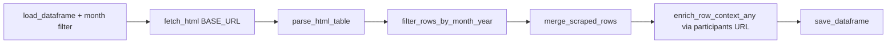

# Crypto Task Force Meetings

[← Back to index](README.md)

## Overview

| | |
|--|--|
| **SEC page** | Crypto Task Force Meetings |
| **Source URL** | https://www.sec.gov/featured-topics/crypto-task-force/crypto-task-force-meetings |
| **Module** | [`pages/crypto_task_force_meetings.py`](../pages/crypto_task_force_meetings.py) |
| **Storage** | `sec_scraping/dataframes/crypto_task_force_meetings.parquet` |

This list has **no pagination** — the full table is on one page. Detail links are **mostly PDFs**.

## Entry point

```python
scrape_crypto_task_force_meetings(
    *,
    year: int = 2026,
    month: int = 3,
    fetch_context: bool = True,
) -> pd.DataFrame
```

| Parameter | Description |
|-----------|-------------|
| `year`, `month` | Filter parsed rows and existing parquet to this month |
| `fetch_context` | Fetch PDF/HTML text from detail links |

## Flow



Uses [`run_single_page_table_scraper`](../core.py).

## List scraping

**Expected headers:** `Date`, `Participants & Associated Materials`

| List column | Source header | Notes |
|-------------|---------------|-------|
| `date` | Date | |
| `participants_associated_materials` | Participants & Associated Materials | Slugified header |
| `participants_associated_materials_url` | Link in materials cell | Primary detail URL (often PDF) |
| `date_normalized` | Derived | During month filter |

## Detail enrichment

- **Merge:** `merge_scraped_rows`
- **Detail URL:** `participants_associated_materials_url` (`primary_detail_url()` — first `*_url` after `title_url` / `status_url`)
- **Method:** `enrich_row_context_any()`
- **`resources`:** Not used

## Deduplication and incremental updates

- **Key:** `row_key` from date + participants text
- **Backfill:** Empty `context` on existing rows when `fetch_context=True`
- **Save cadence:** Once per run (after single list scrape)

## Storage

| | |
|--|--|
| **Path** | `sec_scraping/dataframes/crypto_task_force_meetings.parquet` |
| **Format** | Parquet; CSV fallback |
| **Scope on load** | Month filter via `date_normalized` |

## Column reference

| Column | Source |
|--------|--------|
| `date`, `participants_associated_materials`, `participants_associated_materials_url` | List table |
| `date_normalized` | Month filter |
| `row_key`, `source_list_url`, `scraped_at`, `vectorized` | Metadata |
| `context_title`, `context` | Detail enrichment |

## Example

```python
from sec_scraping.pages.crypto_task_force_meetings import scrape_crypto_task_force_meetings

df = scrape_crypto_task_force_meetings(year=2026, month=3)
```
