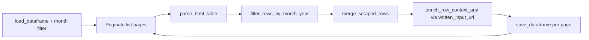

# Crypto Task Force Written Input

[← Back to index](README.md)

## Overview

| | |
|--|--|
| **SEC page** | Crypto Task Force Written Input |
| **Source URL** | https://www.sec.gov/featured-topics/crypto-task-force/crypto-task-force-written-input |
| **Module** | [`pages/crypto_written_input.py`](../pages/crypto_written_input.py) |
| **Storage** | `sec_scraping/dataframes/crypto_written_input.parquet` |

Detail links are **mostly PDFs**.

## Entry point

```python
scrape_crypto_written_input(
    *,
    year: int = 2026,
    month: int = 3,
    max_pages: Optional[int] = None,
    fetch_context: bool = True,
) -> pd.DataFrame
```

## Flow



Uses [`run_paginated_table_scraper`](../core.py) with default pagination URL.

**Pagination URL:**

```
https://www.sec.gov/featured-topics/crypto-task-force/crypto-task-force-written-input?search=&year={year}&month={month}&page={page}
```

## List scraping

**Expected headers:** `Date`, `Written Input`, `Topic(s)`, `Key Points`

| List column | Source header | Notes |
|-------------|---------------|-------|
| `date` | Date | |
| `written_input` | Written Input | |
| `written_input_url` | Written Input link | Detail URL |
| `topic_s` | Topic(s) | Slug: `topic_s` |
| `key_points` | Key Points | |
| `date_normalized` | Derived | Month filter |

## Detail enrichment

- **Merge:** `merge_scraped_rows`
- **Detail URL:** `written_input_url` (via `primary_detail_url()` / `row_fallback_title` uses `written_input`)
- **Method:** `enrich_row_context_any()`
- **`resources`:** Not used

## Deduplication and incremental updates

- **Key:** `row_key` from all non-URL list fields
- **Save cadence:** After each page

## Storage

| | |
|--|--|
| **Path** | `sec_scraping/dataframes/crypto_written_input.parquet` |
| **Format** | Parquet; CSV fallback |
| **Scope on load** | Month filter on `date_normalized` |

## Column reference

| Column | Source |
|--------|--------|
| `date`, `written_input`, `written_input_url`, `topic_s`, `key_points` | List table |
| `date_normalized` | Month filter |
| `row_key`, `source_list_url`, `scraped_at`, `vectorized` | Metadata |
| `context_title`, `context` | Detail enrichment |

## Example

```python
from sec_scraping.pages.crypto_written_input import scrape_crypto_written_input

df = scrape_crypto_written_input(year=2026, month=3, max_pages=5)
```
