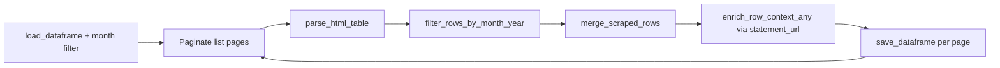

# Crypto@SEC

[← Back to index](README.md)

## Overview

| | |
|--|--|
| **SEC page** | Crypto@SEC (Crypto Task Force statements) |
| **Source URL** | https://www.sec.gov/featured-topics/crypto-task-force/cryptosec |
| **Module** | [`pages/cryptosec.py`](../pages/cryptosec.py) |
| **Storage** | `sec_scraping/dataframes/cryptosec.parquet` |

Supports both **HTML and PDF** detail pages.

## Entry point

```python
scrape_cryptosec(
    *,
    year: int = 2026,
    month: int = 3,
    max_pages: Optional[int] = None,
    fetch_context: bool = True,
) -> pd.DataFrame
```

## Flow



Uses [`run_paginated_table_scraper`](../core.py) with default pagination.

**Pagination URL:**

```
https://www.sec.gov/featured-topics/crypto-task-force/cryptosec?search=&year={year}&month={month}&page={page}
```

## List scraping

**Expected headers:** `Date`, `Speaker/Division`, `Statement`, `Summary`

| List column | Source header | Notes |
|-------------|---------------|-------|
| `date` | Date | |
| `speaker_division` | Speaker/Division | |
| `speaker_division_url` | Speaker/Division link | If linked |
| `statement` | Statement | |
| `statement_url` | Statement link | Primary detail URL |
| `summary` | Summary | List-page summary text only |
| `date_normalized` | Derived | Month filter |

## Detail enrichment

- **Merge:** `merge_scraped_rows`
- **Detail URL:** `statement_url` preferred (`primary_detail_url()` checks `title_url` first, then any `*_url`)
- **Method:** `enrich_row_context_any()`
- **`resources`:** Not used

## Deduplication and incremental updates

- **Key:** `row_key` from date, speaker_division, statement, summary
- **Save cadence:** After each page

## Storage

| | |
|--|--|
| **Path** | `sec_scraping/dataframes/cryptosec.parquet` |
| **Format** | Parquet; CSV fallback |
| **Scope on load** | Month filter on `date_normalized` |

## Column reference

| Column | Source |
|--------|--------|
| `date`, `speaker_division`, `speaker_division_url`, `statement`, `statement_url`, `summary` | List table |
| `date_normalized` | Month filter |
| `row_key`, `source_list_url`, `scraped_at`, `vectorized` | Metadata |
| `context_title`, `context` | Detail enrichment |

## Example

```python
from sec_scraping.pages.cryptosec import scrape_cryptosec

df = scrape_cryptosec(year=2026, month=3, fetch_context=True)
```
