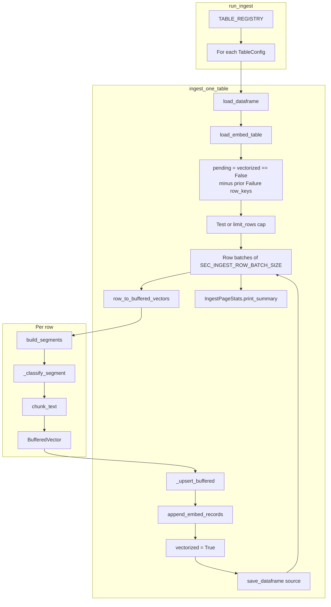
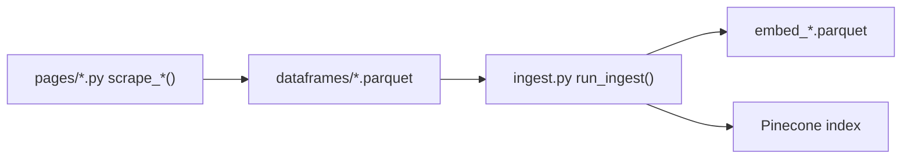

# Dataframe ingest (Pinecone)

[← Back to index](README.md)

## Overview

| | |
|--|--|
| **Module** | [`ingest.py`](../ingest.py) |
| **Input** | `sec_scraping/dataframes/*.parquet` (scraper output) |
| **Backup** | `sec_scraping/dataframes/embed_*.parquet` (classification audit) |
| **Output** | Pinecone vectors (same index as [`crypto_ingest.py`](../../crypto_ingest.py)) |

After scrapers populate `context` (and optional `resources`), ingest classifies each **segment** (main body or one resource) once under the CRI ontology, **chunks** that text, reuses the same classification metadata on every chunk from that segment, **hybrid-embeds** (OpenAI dense + SPLADE sparse), and **upserts** to Pinecone. Successful rows are marked `vectorized=True` on the source parquet.

## Entry point

### CLI

```bash
python -m sec_scraping.ingest
```

### Programmatic

```python
from sec_scraping.ingest import run_ingest

stats = run_ingest(test_mode=True, dry_run=False)
```

| Flag / argument | Description |
|-----------------|-------------|
| `--dataset` | Process one table by `sec_dataset` slug (e.g. `crypto-newsroom`) |
| `--test` | At most **one** pending row per table |
| `--limit-rows N` | Cap pending rows per table (ignored when `--test`) |
| `--dry-run` | Count chunks only; no OpenAI, Pinecone, parquet, or `vectorized` updates |

## End-to-end flow



## Module structure

`ingest.py` is organized in layers:

| Layer | Types / functions | Role |
|-------|-------------------|------|
| **Registry** | `TableConfig`, `TABLE_REGISTRY` | Maps each source parquet to `sec_dataset` slug and metadata columns |
| **Segments** | `TextSegment`, `build_segments()` | Splits a row into embeddable text units (main + resources) |
| **Chunks** | `row_to_buffered_vectors()`, `_classify_segment()` | Per-segment classification, token-aware chunking, shared CRI metadata per chunk |
| **Backup** | `load_embed_table`, `append_embed_records`, `failed_row_keys`, `record_row_failure` | Persists classification and ingest status per chunk / row |
| **Persistence** | `ingest_one_table()` | Row batches, upsert, flip `vectorized`, save parquets |
| **Orchestration** | `run_ingest()`, `main()` | All tables, shared Pinecone/OpenAI clients, rollup summary |
| **Reporting** | `IngestPageStats` | Per-table counters and printed summary |

### External dependencies

Ingest reuses existing project modules instead of duplicating logic:

| Concern | Module |
|---------|--------|
| Chunking, dense embed, sparse encode, index ensure | [`crypto_ingest.py`](../../crypto_ingest.py) |
| Classification, Pinecone vector shape, upsert | [`scripts/sec_crawl_ingestion.py`](../../scripts/sec_crawl_ingestion.py) |
| Parquet I/O, detail URL, title fallback | [`core.py`](../core.py) |
| `source_type` for classifier context | [`cri_ontology/document_context.py`](../../cri_ontology/document_context.py) |

## Table registry

Each scraper parquet has a fixed entry in `TABLE_REGISTRY`:

| Source parquet | `sec_dataset` | Embed backup | Extra Pinecone metadata columns |
|----------------|---------------|--------------|--------------------------------|
| `crypto_newsroom.parquet` | `crypto-newsroom` | `embed_crypto_newsroom.parquet` | `date`, `title`, `speaker` |
| `crypto_task_force_meetings.parquet` | `crypto-task-force-meetings` | `embed_crypto_task_force_meetings.parquet` | `date`, `participants_associated_materials` |
| `crypto_written_input.parquet` | `crypto-written-input` | `embed_crypto_written_input.parquet` | `date`, `written_input`, `topic_s`, `key_points` |
| `cryptosec.parquet` | `cryptosec` | `embed_cryptosec.parquet` | `date`, `speaker_division`, `statement`, `summary` |
| `no_action_letters.parquet` | `no-action-letters` | `embed_no_action_letters.parquet` | `date`, `title`, `division` |
| `press_releases.parquet` | `press-releases` | `embed_press_releases.parquet` | `date`, `headline`, `release_no` |
| `rulemaking_activity.parquet` | `rulemaking-activity` | `embed_rulemaking_activity.parquet` | `issue_date`, `file_number`, `rulemaking`, `status` |
| `speeches_statements.parquet` | `speeches-statements` | `embed_speeches_statements.parquet` | `date`, `title`, `speaker`, `type` |
| `whats_new.parquet` | `whats-new` | `embed_whats_new.parquet` | `date`, `title`, `division_office` |

`TableConfig` also defines `date_columns` (tried in order for `publication_date` metadata): `date_normalized`, `date`, `issue_date`.

## What gets embedded

### Row selection

A row is eligible for ingest when **all** of the following hold:

1. **`vectorized == False`** (or missing, treated as false) on the source parquet.
2. Its **`row_key` is not** listed in the embed backup with **`status == Failure`** (see [Status and retry](#status-and-retry)).

After a successful upsert, ingest sets **`vectorized = True`** on the source parquet and writes chunk rows with **`status = Success`** in `embed_*`. Failed rows keep **`vectorized = False`**; the embed backup records **`Failure`** so they are not retried automatically.

### Text segments (`build_segments`)

For each row:

1. **Main** — non-empty `context` and a detail URL from `primary_detail_url()` (same order as scrapers: `title_url`, `status_url`, then other `*_url` columns).
2. **Resources** — each item in the `resources` JSON list with non-empty `context` and `url` (falls back to main detail URL if `url` is missing).

Each segment is classified once, then split into one or more chunks. Segment metadata uses `content_part`: `main` or `resource`.

### Classification (per segment)

Before chunking, ingest classifies the full segment text (capped for the classifier):

1. Build **document context**: `document_title`, `source_url`, `source_type` (from `infer_source_type_from_url`), `regulatory_body`, `sec_dataset`.
2. Cap segment text with **`SEC_CLASSIFY_MAX_CHARS`** (default **12_000** characters).
3. Call **`_classify_segment()`** (one OpenAI classifier call per segment; retries once with a **4_000**-character excerpt if the first call fails).
4. All chunks from that segment reuse the same domain, subdomain, lifecycle, durability, and confidence fields.

### Chunking

`chunk_text()` from `crypto_ingest` splits segment text with defaults:

- **500** tokens max (~2000 characters)
- **100** token overlap (~400 characters)

Override via `SEC_CHUNK_MAX_TOKENS` and `SEC_CHUNK_OVERLAP_TOKENS`.

### Vector IDs

Stable ids avoid collisions when the same URL appears on multiple rows:

```text
SHA-256("{row_key}|{content_part}|{source_url}|{chunk_index}")
```

Implemented via `make_chunk_id()` on the combined base string.

### `source_url` in Pinecone

Each chunk’s `source_url` is the **detail/document URL** for that segment (main row link or resource `url`), not the scraper list `BASE_URL`.

## Classification and metadata

### Per chunk (after segment classification)

For each chunk, ingest builds **base metadata** and merges the **shared segment classification**:

| Field | Scope |
|-------|--------|
| `document_text`, `chunk_index`, vector `id` | Unique per chunk |
| `domain_*`, `lifecycle_stage`, `durability_tier`, `classification_*`, `validation_status` | Same for all chunks from one segment |

1. Build **base metadata**: `source_url`, `title`, `document_text` (chunk text), `type` (`pdf` / `html`), `sec_dataset`, `row_key`, `chunk_index`, `content_part`, `publication_date`, table-specific fields, optional `source_list_url` and `resource_label`.
2. Merge segment **classified_meta** from `_classify_segment()`.
3. **`sanitize_metadata_for_pinecone()`** merges base + classification for upsert.

### Hybrid vectors

`buffered_to_pinecone_vectors()` produces dense (OpenAI `text-embedding-3-small`) and sparse (SPLADE) vectors per chunk, then `upsert_vector_batch()` writes to the configured namespace.

## Embed backup tables (`embed_*`)

For `dataframes/foo.parquet`, ingest maintains `dataframes/embed_foo.parquet`.

| Column | Description |
|--------|-------------|
| `id` | Pinecone vector id (same as chunk id) |
| `row_key` | Source row dedup key |
| `sec_dataset` | Table slug (e.g. `crypto-newsroom`) |
| `source_url` | Detail URL for this chunk |
| `content_part` | `main` or `resource` |
| `chunk_index` | Index within segment |
| `domain_primary`, `domain_secondary`, `subdomain`, `lifecycle_stage`, `durability_tier` | CRI classification |
| `classification_confidence`, `classification_reason`, `validation_status` | Classifier output |
| `classification_validation_errors`, `classification_error` | Optional diagnostics |
| `classified_at`, `ingested_at` | UTC ISO-8601 timestamps |
| `status` | `Success` or `Failure` |
| `reason` | Empty on success; error message on failure (max 500 chars) |

### Record types

| Type | `content_part` | `status` | `reason` |
|------|----------------|----------|----------|
| **Chunk** (upserted) | `main` or `resource` | `Success` | empty / null |
| **Row failure** | `_row_status` | `Failure` | error text (e.g. exception message or `no embeddable text`) |

Row failure rows use a stable id: `SHA-256("{row_key}|_row_status|0|0")` and `chunk_index = -1`. Classification columns are empty on failure rows.

**Write timing**: backup rows are appended after each row batch (success chunks and failure markers). **`append_embed_records`** dedupes chunk rows by `id`; failure rows dedupe by `row_key` (replaces prior `_row_status` / `Failure` rows for that key).

Legacy embed files without `status` are treated as retry-eligible until a `Failure` row exists for that `row_key`.

Use backups to audit classifications, recover vector ids, or see why a row was skipped.

## Status and retry

| `status` | `reason` | Meaning |
|----------|----------|---------|
| `Success` | empty | Chunk classified and upserted to Pinecone |
| `Failure` | non-empty | Row ingest failed; **will not run again** until the failure row is removed |

Failures are recorded when:

- Chunk build or classification raises an exception
- Pinecone upsert raises an exception
- No embeddable text (`context` and resource contexts all empty) — reason: `no embeddable text`

**To retry a failed row:** delete its `_row_status` row (or any `Failure` row with that `row_key`) from the relevant `embed_*.parquet`, ensure source `context` is filled if needed, then re-run ingest.

`ingest_one_table()` logs how many rows were skipped due to prior failure (`rows_already_failed` in the job summary).

## Batching and failure behavior

| Batch type | Default env | Behavior |
|------------|-------------|----------|
| **Rows** | `SEC_INGEST_ROW_BATCH_SIZE=10` | Process up to 10 pending indices, then save source parquet |
| **Vectors** | `SEC_INGEST_VECTOR_BATCH_SIZE=32` | Upsert chunks to Pinecone in sub-batches |

| Outcome | `vectorized` | `embed_*` | Counted in stats |
|---------|--------------|-----------|------------------|
| Upsert succeeds | Set `True` | Chunk rows: `Success` | `rows_embedded`, `chunks_upserted` |
| No embeddable text | Unchanged | `_row_status`: `Failure` | `rows_skipped`, `failures` |
| Classify/upsert error | Unchanged | `_row_status`: `Failure` | `failures` |
| Prior `Failure` in embed backup | Unchanged | (unchanged) | `rows_already_failed` |

Errors print `row_key` to stdout; other rows in the batch continue.

## Job summary

After each table, `IngestPageStats.print_summary()` prints pending, `rows_already_failed`, processed, embedded, skipped, chunk, backup, and failure counts.

When multiple tables run, `run_ingest()` prints a rollup:

```text
=== Ingest job complete ===
  crypto-newsroom                  rows_embedded=1  chunks=2
  ...
  TOTAL                            rows_embedded=9  chunks=943
```

In **`--dry-run`**, summaries use `rows_processed` and chunk counts only; `vectorized` and embed backups are not updated.

## Environment variables

| Variable | Default | Purpose |
|----------|---------|---------|
| `PINECONE_API_KEY` | (required for live run) | Pinecone authentication |
| `PINECONE_INDEX_NAME` | `sec-cryto-knowledge-base-rag` | Target index |
| `PINECONE_NAMESPACE` | `sec-knowledge-base` | Namespace |
| `SEC_CLASSIFY_MAX_CHARS` | `12000` | Max characters of segment text sent to the CRI classifier |
| `SEC_CHUNK_MAX_TOKENS` | `500` | Chunk size |
| `SEC_CHUNK_OVERLAP_TOKENS` | `100` | Chunk overlap |
| `SEC_INGEST_ROW_BATCH_SIZE` | `10` | Rows per save cycle |
| `SEC_INGEST_VECTOR_BATCH_SIZE` | `32` | Vectors per upsert call |

OpenAI is used for embeddings and CRI classification (see `CRI_CLASSIFIER_MODEL` in `cri_ontology`).

## Relationship to scrapers



1. Run a scraper with `fetch_context=True` so `context` (and `resources` where applicable) are filled.
2. Run ingest on pending rows (`vectorized=False`).
3. Query the knowledge base via the Streamlit app or `crypto_ingest.hybrid_search()`.

Per-page scraper docs: [README.md](README.md) index.

## Example commands

```bash
# Smoke test: one row per table, full pipeline
python -m sec_scraping.ingest --test

# Preview chunk counts without API cost
python -m sec_scraping.ingest --test --dry-run

# Single dataset, full pending backlog
python -m sec_scraping.ingest --dataset rulemaking-activity

# Cap rows for a partial run
python -m sec_scraping.ingest --dataset crypto-newsroom --limit-rows 3
```
