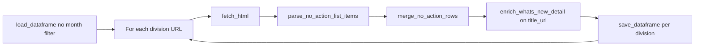

# No-Action Letters

[← Back to index](README.md)

## Overview

| | |
|--|--|
| **SEC page** | No-Action, Interpretive, and Exemptive Letters (by division) |
| **Module** | [`pages/no_action_letters.py`](../pages/no_action_letters.py) |
| **Storage** | `sec_scraping/dataframes/no_action_letters.parquet` |

Unlike table-based scrapers, this module parses **Drupal list items** (`<li data-list-item-id>`) from three division index pages. No pagination; optional `test_mode` limits items per division.

## Entry point

```python
scrape_no_action_letters(
    *,
    fetch_context: bool = True,
    test_mode: bool = False,
) -> pd.DataFrame
```

| Parameter | Description |
|-----------|-------------|
| `test_mode` | If `True`, only first 2 and last 2 parseable items per division |
| `fetch_context` | Fetch detail content for new rows |

**CLI** (`python -m sec_scraping.pages.no_action_letters`):

- `--test` — enable `test_mode`
- `--no-context` — skip detail fetching

## Division source URLs

| `division` slug | URL |
|-----------------|-----|
| `corporation_finance` | https://www.sec.gov/rules-regulations/no-action-interpretive-exemptive-letters/division-corporation-finance-no-action |
| `investment_management` | https://www.sec.gov/rules-regulations/no-action-interpretive-exemptive-letters/division-investment-management-staff-no-action-interpretive-letters |
| `trading_markets` | https://www.sec.gov/rules-regulations/no-action-interpretive-exemptive-letters/division-trading-markets-no-action |

## Flow



Uses [`run_no_action_list_scraper`](../core.py).

## List scraping

**Parser:** `parse_no_action_list_items()` — not `parse_html_table()`

- Root: `#main-content` or `div.content-wrapper`
- Each `<li>` must have an `<a href>` (not `#`, `mailto:`, or `javascript:`)
- Date parsed from list item text after the anchor title
- Rows without a normalizable date are skipped

| Field | Column | Notes |
|-------|--------|-------|
| Drupal id or URL hash | `list_item_id` | `data-list-item-id` or SHA-256 of `title_url` |
| Anchor text | `title` | |
| Parsed date | `date`, `date_normalized` | |
| href | `title_url` | Absolute SEC URL |
| Division slug | `division` | Set during merge |

## Detail enrichment

- **Merge:** `merge_no_action_rows` — dedupe by **`list_item_id`** (also copied to `row_key`)
- **Detail URL:** `title_url`
- **Method:** `enrich_whats_new_detail()` (file vs HTML + `resources`)

## Deduplication and incremental updates

- **Key:** `list_item_id` (stored as `row_key` too)
- **Backfill:** When `_needs_detail_enrichment()` and `fetch_context=True`
- **Save cadence:** After **each division** completes
- **No month filter** on load or between divisions

### Test mode

When `test_mode=True`, after parsing all items for a division, only the **first 2** and **last 2** rows are kept (deduped by `list_item_id` if ranges overlap).

## Storage

| | |
|--|--|
| **Path** | `sec_scraping/dataframes/no_action_letters.parquet` |
| **Format** | Parquet; CSV fallback |
| **Scope on load** | Full dataset (all divisions and dates) |

## Column reference

| Column | Source |
|--------|--------|
| `list_item_id`, `title`, `date`, `title_url`, `division` | List parsing + merge |
| `row_key` | Same as `list_item_id` |
| `date_normalized` | From `date` in merge |
| `source_list_url`, `scraped_at`, `vectorized` | Metadata |
| `context_title`, `context` | Detail enrichment |
| `resources` | Right-rail JSON (HTML) or `"[]"` (files) |

## Example

```python
from sec_scraping.pages.no_action_letters import scrape_no_action_letters

# Full scrape with detail text
df = scrape_no_action_letters(fetch_context=True, test_mode=False)

# Quick smoke test (2 + 2 items per division)
df_test = scrape_no_action_letters(test_mode=True)
```

```bash
python -m sec_scraping.pages.no_action_letters --test
```
