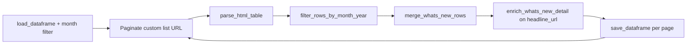

# Press Releases

[← Back to index](README.md)

## Overview

| | |
|--|--|
| **SEC page** | SEC Newsroom — Press Releases |
| **Source URL** | https://www.sec.gov/newsroom/press-releases |
| **Module** | [`pages/press_releases.py`](../pages/press_releases.py) |
| **Storage** | `sec_scraping/dataframes/press_releases.parquet` |

Shares the same merge and enrichment logic as [What's New](whats_new.md) (`merge_whats_new_rows`, `enrich_whats_new_detail`). The primary list link column is `headline_url` rather than `title_url`.

## Entry point

```python
scrape_press_releases(
    *,
    year: int = 2026,
    month: int = 3,
    combine: str = "",
    field_person_target_id: str = "",
    speaker: str = "",
    max_pages: Optional[int] = None,
    fetch_context: bool = True,
) -> pd.DataFrame
```

| Parameter | Description |
|-----------|-------------|
| `combine` | Search text filter |
| `field_person_target_id` | Person/entity Drupal id filter |
| `speaker` | Speaker name filter |

## Flow



## List scraping

**Expected headers:** `Date`, `Headline`, `Release No.`

**Pagination URL** (`build_press_releases_list_url`):

```
https://www.sec.gov/newsroom/press-releases?combine={combine}&year={year}&month={month}&field_person_target_id={field_person_target_id}&speaker={speaker}&page={page}
```

| List column | Source header | Notes |
|-------------|---------------|-------|
| `date` | Date | |
| `headline` | Headline | |
| `headline_url` | Headline link | Detail URL (`primary_detail_url` falls through to this `*_url`) |
| `release_no` | Release No. | |
| `date_normalized` | Derived | Month filter + merge |

## Detail enrichment

- **Merge:** `merge_whats_new_rows`
- **Detail URL:** `headline_url` (no `title_url` on this scraper — resolved as first available `*_url`)
- **Method:** `enrich_whats_new_detail()` — file vs HTML branching; `row_fallback_title` includes `headline`
- **`resources`:** JSON on HTML pages; `"[]"` for file URLs

## Deduplication and incremental updates

- **Key:** `row_key` from date, headline, release_no
- **Backfill:** Same as What's New when context/resources empty
- **Save cadence:** After each page

## Storage

| | |
|--|--|
| **Path** | `sec_scraping/dataframes/press_releases.parquet` |
| **Format** | Parquet; CSV fallback |
| **Scope on load** | Month filter on `date_normalized` |

## Column reference

| Column | Source |
|--------|--------|
| `date`, `headline`, `headline_url`, `release_no` | List table |
| `date_normalized` | Month filter / merge |
| `row_key`, `source_list_url`, `scraped_at`, `vectorized` | Metadata |
| `context_title`, `context` | Detail enrichment |
| `resources` | Right-rail JSON (HTML details) |

## Example

```python
from sec_scraping.pages.press_releases import scrape_press_releases

df = scrape_press_releases(year=2026, month=3, speaker="")
```
