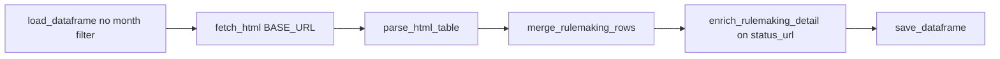

# Rulemaking Activity

[← Back to index](README.md)

## Overview

| | |
|--|--|
| **SEC page** | Rulemaking Activity |
| **Source URL** | https://www.sec.gov/rules-regulations/rulemaking-activity |
| **Module** | [`pages/rulemaking_activity.py`](../pages/rulemaking_activity.py) |
| **Storage** | `sec_scraping/dataframes/rulemaking_activity.parquet` |

Custom scraper: **no year/month parameters**, no month filter on load. Each run fetches the full current table and merges new rows. Detail enrichment uses the **Status** column link.

## Entry point

```python
scrape_rulemaking_activity(*, fetch_context: bool = True) -> pd.DataFrame
```

## Flow



Implemented directly in [`rulemaking_activity.py`](../pages/rulemaking_activity.py) (not via `run_paginated_table_scraper`).

## List scraping

**Expected headers:** `Issue Date`, `File Number`, `Rulemaking`, `Status`

| List column | Source header | Notes |
|-------------|---------------|-------|
| `issue_date` | Issue Date | Used for `date_normalized` |
| `file_number` | File Number | |
| `rulemaking` | Rulemaking | |
| `rulemaking_url` | Rulemaking link | If present |
| `status` | Status | |
| `status_url` | Status link | **Primary detail URL** |
| `date_normalized` | Derived | From `issue_date` in merge |

## Detail enrichment

- **Merge:** `merge_rulemaking_rows`
- **Detail URL:** `status_url` (`primary_detail_url()`)
- **Method:** `enrich_rulemaking_detail()` — single HTTP GET; parses HTML body and right-rail resources
- **`resources`:** JSON list of `{label, url, context_title, context}`; default `"[]"` for new rows

## Deduplication and incremental updates

- **Key:** `row_key` from issue_date, file_number, rulemaking, status
- **Backfill:** Refetches when `_needs_detail_enrichment()` (empty context/resources)
- **Save cadence:** Once per run (after merge if new rows parsed)
- **No month scope:** Existing parquet is loaded as-is without `normalize_and_filter_dataframe()`

## Storage

| | |
|--|--|
| **Path** | `sec_scraping/dataframes/rulemaking_activity.parquet` |
| **Format** | Parquet; CSV fallback |
| **Scope on load** | Full history retained (not filtered by month) |

## Column reference

| Column | Source |
|--------|--------|
| `issue_date`, `file_number`, `rulemaking`, `rulemaking_url`, `status`, `status_url` | List table |
| `date_normalized` | From `issue_date` |
| `row_key`, `source_list_url`, `scraped_at`, `vectorized` | Metadata |
| `context_title`, `context` | Status detail page |
| `resources` | Status page right-rail links |

## Example

```python
from sec_scraping.pages.rulemaking_activity import scrape_rulemaking_activity

df = scrape_rulemaking_activity(fetch_context=True)
print(df[["issue_date", "rulemaking", "status"]].head())
```
