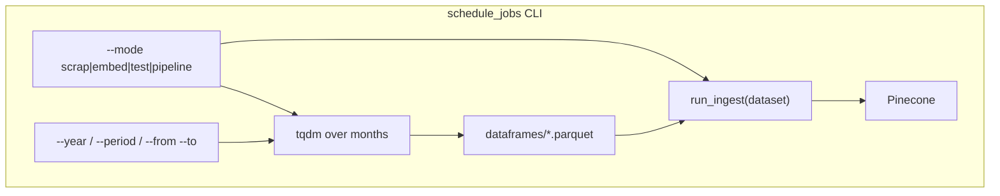

# Scheduled scrape and embed jobs

[← Back to index](README.md)

## Overview

| | |
|--|--|
| **Package** | [`schedule_jobs/`](../schedule_jobs/) |
| **Scrape** | [`pages/*.py`](../pages/) via [`core.py`](../core.py) |
| **Embed** | [`ingest.py`](../ingest.py) — see [ingest.md](ingest.md) |
| **One CLI per page** | `python -m sec_scraping.schedule_jobs.<page>` |

Scheduled jobs are the **operational entry point** for running scrape → parquet → embed → Pinecone per SEC list page. They replace hand-editing [`demo.py`](../demo.py) for production runs.



## List all jobs

```bash
python -m sec_scraping.schedule_jobs
```

## Modes (`--mode`)

| Mode | Scrape | Embed |
|------|--------|-------|
| `scrap` (default) | Yes — all resolved periods | No |
| `embed` | No | Yes — pending `vectorized=False` rows |
| `test` | Yes — first period only, `max_pages=1` (dated pages); no-action uses `test_mode=True` | Yes — at most one pending row |
| `pipeline` | Yes — full scrape for periods | Yes — once after scrape |

### Extra flags

| Flag | Applies to | Description |
|------|------------|-------------|
| `--dry-run` | embed | Chunk/count only; no API writes or `vectorized` updates |
| `--no-context` | scrape | Skip detail/PDF text fetch |
| `--limit-rows N` | embed | Cap pending rows (ignored in `test` mode) |
| `--verbose` | all | DEBUG logging to console |

## Period selection

Default when no period flags are passed: **March 2026** (`2026-03`).

| Flags | Example | Result |
|-------|---------|--------|
| *(none)* | | `2026-03` |
| `--year 2025` | full year | Jan–Dec 2025 (12 scrape runs) |
| `--from 2025-03 --to 2025-09` | range | Mar–Sep 2025 inclusive |
| `--period 2025-03` | specific month | Repeatable; union with other flags |
| `--period march-2025` | name alias | Same as `2025-03` |

Period flags are **ignored** (with a warning) for [rulemaking activity](schedule_jobs_rulemaking_activity.md) and [no-action letters](schedule_jobs_no_action_letters.md).

## Logging and progress

- Console **logging** at INFO (`--verbose` → DEBUG), logger name `sec_scraping.schedule_jobs`.
- **tqdm** over months during scrape (`scrape months`).
- **tqdm** over pending rows during ingest (`ingest <dataset>`), with postfix `embedded` / `failures`.

## Job summary

After each run, a summary is printed:

```text
=== Job summary: crypto-newsroom (scrap) ===
  page:            Crypto Newsroom
  dataframe:       .../crypto_newsroom.parquet
  periods_run:     1
  rows_added:      5
  total_rows:      120
    2026-03: +5 rows (115 -> 120)
```

Embed details also come from [`IngestPageStats`](../ingest.py) (`=== Ingest summary: ... ===`).

## Page job index

| Scheduled job doc | Module | `sec_dataset` | Periods |
|-------------------|--------|---------------|---------|
| [schedule_jobs_crypto_newsroom.md](schedule_jobs_crypto_newsroom.md) | `schedule_jobs.crypto_newsroom` | `crypto-newsroom` | Yes |
| [schedule_jobs_crypto_written_input.md](schedule_jobs_crypto_written_input.md) | `schedule_jobs.crypto_written_input` | `crypto-written-input` | Yes |
| [schedule_jobs_crypto_task_force_meetings.md](schedule_jobs_crypto_task_force_meetings.md) | `schedule_jobs.crypto_task_force_meetings` | `crypto-task-force-meetings` | Yes |
| [schedule_jobs_cryptosec.md](schedule_jobs_cryptosec.md) | `schedule_jobs.cryptosec` | `cryptosec` | Yes |
| [schedule_jobs_whats_new.md](schedule_jobs_whats_new.md) | `schedule_jobs.whats_new` | `whats-new` | Yes |
| [schedule_jobs_press_releases.md](schedule_jobs_press_releases.md) | `schedule_jobs.press_releases` | `press-releases` | Yes |
| [schedule_jobs_speeches_statements.md](schedule_jobs_speeches_statements.md) | `schedule_jobs.speeches_statements` | `speeches-statements` | Yes |
| [schedule_jobs_rulemaking_activity.md](schedule_jobs_rulemaking_activity.md) | `schedule_jobs.rulemaking_activity` | `rulemaking-activity` | No |
| [schedule_jobs_no_action_letters.md](schedule_jobs_no_action_letters.md) | `schedule_jobs.no_action_letters` | `no-action-letters` | No |

## Example workflows

```bash
# Default scrape: March 2026
python -m sec_scraping.schedule_jobs.crypto_newsroom --mode scrap

# Full calendar year
python -m sec_scraping.schedule_jobs.press_releases --mode scrap --year 2025

# Scrape a range, then embed everything pending
python -m sec_scraping.schedule_jobs.speeches_statements --mode pipeline \
  --from 2025-03 --to 2025-09

# Smoke test (minimal scrape + one embed row)
python -m sec_scraping.schedule_jobs.no_action_letters --mode test

# Embed only, no API cost preview
python -m sec_scraping.schedule_jobs.crypto_newsroom --mode embed --dry-run
```

## Related docs

- Scraper behavior: [README.md](README.md) and per-page `*.md` in this folder
- Embed pipeline: [ingest.md](ingest.md)
