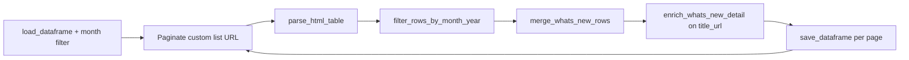

# Speeches and Statements

[← Back to index](README.md)

## Overview

| | |
|--|--|
| **SEC page** | SEC Newsroom — Speeches and Statements |
| **Source URL** | https://www.sec.gov/newsroom/speeches-statements |
| **Module** | [`pages/speeches_statements.py`](../pages/speeches_statements.py) |
| **Storage** | `sec_scraping/dataframes/speeches_statements.parquet` |

Same enrichment family as [What's New](whats_new.md) and [Press Releases](press_releases.md).

## Entry point

```python
scrape_speeches_statements(
    *,
    year: int = 2026,
    month: int = 3,
    field_person_target_id: str = "",
    speaker: str = "",
    news_type: str = "All",
    max_pages: Optional[int] = None,
    fetch_context: bool = True,
) -> pd.DataFrame
```

| Parameter | Description |
|-----------|-------------|
| `field_person_target_id` | Person filter (Drupal id) |
| `speaker` | Speaker name filter |
| `news_type` | Type filter (default `All`) |

## Flow



## List scraping

**Expected headers:** `Date`, `Title`, `Speaker`, `Type`

**Pagination URL** (`build_speeches_statements_list_url`):

```
https://www.sec.gov/newsroom/speeches-statements?field_person_target_id={field_person_target_id}&year={year}&month={month}&speaker={speaker}&news_type={news_type}&page={page}
```

| List column | Source header | Notes |
|-------------|---------------|-------|
| `date` | Date | |
| `title` | Title | |
| `title_url` | Title link | Detail URL |
| `speaker` | Speaker | |
| `speaker_url` | Speaker link | If linked |
| `type` | Type | Speech/statement category |
| `date_normalized` | Derived | Month filter + merge |

## Detail enrichment

- **Merge:** `merge_whats_new_rows`
- **Detail URL:** `title_url`
- **Method:** `enrich_whats_new_detail()`
- **`resources`:** JSON on HTML pages; `"[]"` for file URLs

## Deduplication and incremental updates

- **Key:** `row_key` from date, title, speaker, type
- **Save cadence:** After each page

## Storage

| | |
|--|--|
| **Path** | `sec_scraping/dataframes/speeches_statements.parquet` |
| **Format** | Parquet; CSV fallback |
| **Scope on load** | Month filter on `date_normalized` |

## Column reference

| Column | Source |
|--------|--------|
| `date`, `title`, `title_url`, `speaker`, `speaker_url`, `type` | List table |
| `date_normalized` | Month filter / merge |
| `row_key`, `source_list_url`, `scraped_at`, `vectorized` | Metadata |
| `context_title`, `context` | Detail enrichment |
| `resources` | Right-rail JSON |

## Example

```python
from sec_scraping.pages.speeches_statements import scrape_speeches_statements

df = scrape_speeches_statements(
    year=2026,
    month=3,
    news_type="All",
    fetch_context=True,
)
```
