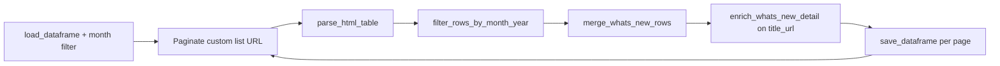

# What's New

[← Back to index](README.md)

## Overview

| | |
|--|--|
| **SEC page** | SEC Newsroom — What's New |
| **Source URL** | https://www.sec.gov/newsroom/whats-new |
| **Module** | [`pages/whats_new.py`](../pages/whats_new.py) |
| **Storage** | `sec_scraping/dataframes/whats_new.parquet` |

Uses the newsroom enrichment pipeline: HTML detail pages include **right-rail resources** as JSON; file links store text only.

## Entry point

```python
scrape_whats_new(
    *,
    year: int = 2026,
    month: int = 3,
    division: str = "All",
    tag: str = "36696",
    type_param: str = "news,secarticle,link",
    max_pages: Optional[int] = None,
    fetch_context: bool = True,
) -> pd.DataFrame
```

| Parameter | Description |
|-----------|-------------|
| `division` | SEC division filter (default `All`) |
| `tag` | Drupal tag id (default `36696`) |
| `type_param` | Content types query (default `news,secarticle,link`) |

## Flow



Uses [`run_paginated_table_scraper`](../core.py) with `build_whats_new_list_url` and `merge_whats_new_rows`.

## List scraping

**Expected headers:** `Date`, `Title`, `Division/Office`

**Pagination URL** (`build_whats_new_list_url`):

```
https://www.sec.gov/newsroom/whats-new?search=&year={year}&month={month}&division={division}&tag={tag}&type={type_param}&page={page}
```

| List column | Source header | Notes |
|-------------|---------------|-------|
| `date` | Date | |
| `title` | Title | |
| `title_url` | Title link | Detail URL |
| `division_office` | Division/Office | Slug: `division_office` |
| `date_normalized` | Derived | Month filter + merge |

## Detail enrichment

- **Merge:** `merge_whats_new_rows`
- **Detail URL:** `title_url` (`primary_detail_url()`)
- **Method:** `enrich_whats_new_detail()`
  - **File URL** (PDF, etc.): `enrich_row_context_any()`; `resources = "[]"`
  - **HTML:** `enrich_rulemaking_detail()` — body + side-rail `resources` JSON

## Deduplication and incremental updates

- **Key:** `row_key` from date, title, division_office
- **Backfill:** Uses `_needs_detail_enrichment()` — refetches when context or resources missing
- **Save cadence:** After each page

## Storage

| | |
|--|--|
| **Path** | `sec_scraping/dataframes/whats_new.parquet` |
| **Format** | Parquet; CSV fallback |
| **Scope on load** | Month filter on `date_normalized` |

## Column reference

| Column | Source |
|--------|--------|
| `date`, `title`, `title_url`, `division_office` | List table |
| `date_normalized` | Month filter / merge |
| `row_key`, `source_list_url`, `scraped_at`, `vectorized` | Metadata |
| `context_title`, `context` | Detail enrichment |
| `resources` | JSON string of right-rail links + their text |

## Example

```python
from sec_scraping.pages.whats_new import scrape_whats_new

df = scrape_whats_new(
    year=2026,
    month=3,
    division="All",
    tag="36696",
    fetch_context=True,
)
```
